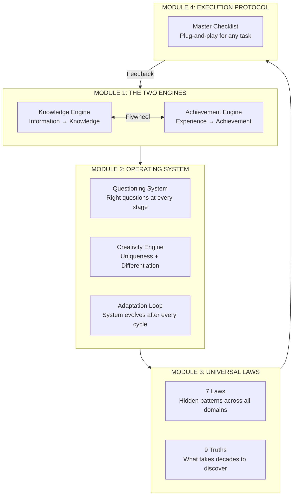

# The Complete Parameter System (CPS)

> **One system. Any work. Any field. Any human.** Base any task on these parameters and achieve what others call unachievable.

---

## The Master Equation

```
┌───────────────────────────────────────────────────────────────────────────────┐
│                                                                               │
│   OUTPUT = (Knowledge × Achievement) ^ Iteration Speed                        │
│                                                                               │
│   AMPLIFIED BY  → 7 Universal Laws                                           │
│   GOVERNED BY   → 9 Hidden Truths                                            │
│   POWERED BY    → Questioning System + Creativity Engine + Adaptation Loop    │
│                                                                               │
│   RESULT        → Respect / Pay / Appreciation from the world                │
│                                                                               │
└───────────────────────────────────────────────────────────────────────────────┘
```

---

## The Root Truth (Why This Exists)

The world only respects, pays, or appreciates a human for **two things**:

| What | Raw Material | Refining Process | Without Refining |
|---|---|---|---|
| **KNOWLEDGE** — what you KNOW | Information | Filter → Structure → Connect → Test | You have data, not knowledge |
| **ACHIEVEMENT** — what you DID | Experience | Deliberate → Reflect → Document → Iterate | You have years, not results |

- Knowledge without Achievement = **Theorist** ("All talk")
- Achievement without Knowledge = **Lucky** ("One-hit wonder")
- Knowledge × Achievement = **Authority** ("I'll pay whatever you ask")

> [!IMPORTANT]
> Everything in this system exists to move you into the **Authority quadrant** — systematically, not by accident.

---

## System Architecture — 5 Modules



---

## Module Map (Navigate the System)

| Module | File | What It Contains | When To Use |
|---|---|---|---|
| **Module 1** | `01_engines.md` | Knowledge Engine (5 stages) + Achievement Engine (5 stages) + Flywheel + Quadrants + Depth Layers | Understanding HOW knowledge and achievement are built |
| **Module 2** | `02_operating_system.md` | Questioning System (4 question types × every stage) + Creativity Engine (systematic uniqueness) + Adaptation Loop (self-evolving system) | The OPERATING LAYER that runs during all work |
| **Module 3** | `03_universal_laws.md` | 7 Hidden Laws (Inversion, Speed, Constraints, Adjacent Possible, Antifragility, Barbell, Map≠Territory) + 9 Truths | The INVISIBLE FORCES that determine success or failure |
| **Module 4** | `04_execution_protocol.md` | Complete pre-flight checklist + execution checklist + post-execution review | The PLUG-AND-PLAY action layer — use before/during/after ANY task |

---

## How The Modules Connect

```
START ANY WORK
      │
      ▼
┌─ MODULE 1: What are my Knowledge and Achievement levels for this task?
│     Knowledge Engine: Do I have refined knowledge or just raw information?
│     Achievement Engine: Do I have proven results or just time spent?
│     Flywheel: Am I feeding each into the other?
│
├─ MODULE 2: Am I asking the right questions? Creating unique output? Adapting?
│     Questioning System: Are my questions deep enough?
│     Creativity Engine: Is my output differentiated or generic?
│     Adaptation Loop: Is the system improving from this execution?
│
├─ MODULE 3: Am I following or violating the universal laws?
│     7 Laws: Have I inverted? Am I iterating fast? Using constraints?
│     9 Truths: Am I avoiding the silent killers?
│
└─ MODULE 4: Execute with the checklist. Every unticked box = work remaining.
      │
      ▼
COMPLETE. ADAPT. NEXT CYCLE.
```

---

## The One Rule

```
┌───────────────────────────────────────────────────────────────────────────────┐
│                                                                               │
│  Build KNOWLEDGE from information. Convert EXPERIENCE into achievement.       │
│  Ask the RIGHT QUESTIONS. Create UNIQUE output. ADAPT after every cycle.      │
│  Follow the 7 LAWS. Remember the 9 TRUTHS. Execute the CHECKLIST.            │
│  Iterate FAST. Compound ALWAYS. That's the complete parameter.                │
│                                                                               │
└───────────────────────────────────────────────────────────────────────────────┘
```
