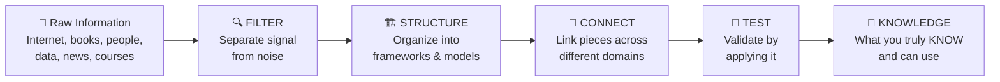
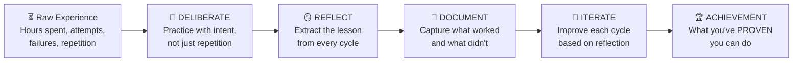
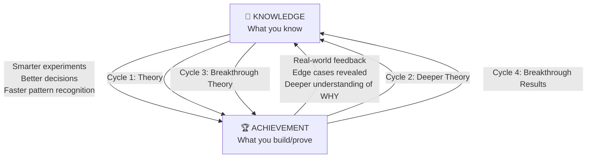

# The Root Law: Knowledge × Achievement

> The world only respects, pays, or appreciates a human being for exactly **two things**: what they **KNOW** and what they've **DONE**. Everything else is a derivative.

---

## The Deepest Root

```
┌──────────────────────────────────────────────────────────────────────────┐
│                                                                          │
│   RESPECT / PAY / APPRECIATION                                           │
│        ↑                                                                 │
│        │ comes ONLY from                                                 │
│        │                                                                 │
│   ┌────┴──────────────────────────┐                                      │
│   │                               │                                      │
│   │  KNOWLEDGE    ×    ACHIEVEMENT │                                     │
│   │  (what you KNOW)  (what you DID)                                     │
│   │      ↑                  ↑                                            │
│   │      │                  │                                            │
│   │  INFORMATION      EXPERIENCE                                         │
│   │  (raw material)   (raw material)                                     │
│   │                               │                                      │
│   └───────────────────────────────┘                                      │
│                                                                          │
│   This is the universal truth across ALL domains.                        │
│                                                                          │
└──────────────────────────────────────────────────────────────────────────┘
```

---

## The Two Pillars — In Depth

### Pillar 1: KNOWLEDGE (from Information)

> *"Information is the ore. Knowledge is the refined metal."*

Not all information becomes knowledge. There is a **refining process**:



| Stage | What Happens | Without This Stage |
|---|---|---|
| **Filter** | You separate what matters from what's noise | You drown in data, know everything about nothing |
| **Structure** | You organize into mental models and frameworks | You have random facts, no system to retrieve them |
| **Connect** | You link ideas across domains — this is where insight lives | You're a specialist with no creative power |
| **Test** | You apply it to real situations and see if it holds | You have theory with no confidence it works |

> [!IMPORTANT]
> **Knowledge is NOT information.** A person who has read 1,000 books but can't apply any of it has information, not knowledge. Knowledge = Information that has been filtered, structured, connected, and tested.

---

### Pillar 2: ACHIEVEMENT (from Experience)

> *"Experience is the hours. Achievement is the proof."*

Not all experience becomes achievement. There is a **conversion process**:



| Stage | What Happens | Without This Stage |
|---|---|---|
| **Deliberate** | You practice with specific purpose, not autopilot | 10 years feels like 1 year repeated 10 times |
| **Reflect** | You extract the WHY behind each success and failure | You keep making the same mistakes |
| **Document** | You capture patterns so you can replicate success | You can't teach it, scale it, or sell it |
| **Iterate** | Each cycle is better than the last | You plateau — busy but not growing |

> [!IMPORTANT]
> **Achievement is NOT experience.** A person who has 20 years in a field but nothing to show for it has experience, not achievement. Achievement = Experience that has been deliberate, reflected upon, documented, and iterated.

---

## The Four Quadrants — Why Both Matter

This is where it becomes crystal clear why the world values both:

```
                        ACHIEVEMENT
                    LOW            HIGH
               ┌─────────────┬──────────────┐
               │             │              │
          HIGH │  THEORIST   │   AUTHORITY  │
               │             │              │
               │ Knows a lot │ Knows AND    │
   KNOWLEDGE   │ Built nothing│ has built    │
               │             │              │
               │ "All talk"  │ "THE person" │
               ├─────────────┼──────────────┤
               │             │              │
          LOW  │  INVISIBLE  │   LUCKY      │
               │             │              │
               │ Knows nothing│ Built some-  │
               │ Built nothing│ thing, can't │
               │             │ explain why  │
               │ "Who?"      │ "One-hit"    │
               └─────────────┴──────────────┘
```

| Quadrant | What the World Says | Why |
|---|---|---|
| **Theorist** (High Knowledge, Low Achievement) | *"Interesting, but what have you DONE?"* | They read, study, analyze — but never ship. Respect comes with a ceiling. |
| **Lucky** (Low Knowledge, High Achievement) | *"Impressive, but can you do it again?"* | They got results once — maybe timing, maybe luck. Can't replicate, can't teach. |
| **Invisible** (Low Knowledge, Low Achievement) | *"Who are you?"* | Nothing to offer. Not cruel — just invisible. The starting point for everyone. |
| **Authority** (High Knowledge, High Achievement) | *"I'll pay whatever you ask."* | They KNOW the domain deeply AND have PROVEN results. **This is the only quadrant that earns lasting respect, pay, and appreciation.** |

> [!CAUTION]
> Most people are stuck in one of the first three quadrants. The entire purpose of any execution system is to move you to the **Authority quadrant** — systematically, not by accident.

---

## The Compound Flywheel — How They Feed Each Other

This is the additional angle that makes the model even more powerful. Knowledge and Achievement are **not separate streams** — they create a **flywheel**:



**Each turn of the flywheel:**

| Cycle | Knowledge Feeds → | → Achievement Feeds → | → Deeper Knowledge |
|---|---|---|---|
| **1st** | You study what others built | You attempt → get raw results | You now know what textbooks DON'T tell you |
| **2nd** | You combine book knowledge + real-world lessons | You attempt with sharper aim → better results | You discover hidden variables invisible to beginners |
| **3rd** | You see patterns across multiple cycles | Your execution becomes precise and efficient | You develop intuition — "feel" for the domain |
| **Nth** | You've built a mental model no textbook contains | Your results are consistently exceptional | You ARE the authority. Others study YOUR work. |

> [!TIP]
> **The flywheel accelerates.** Each cycle is faster and more powerful than the last. The person on Cycle 10 isn't just 10x better than Cycle 1 — they're 100x better because the compound effect stacks.

---

## Six Additional Thinking Angles

Beyond the core two pillars, here are six deeper ways to think about this truth:

### Angle 1: The Market Pays for Different Things at Different Levels

```
ENTRY LEVEL    → Pays for KNOWLEDGE (what you learned in school/courses)
MID LEVEL      → Pays for ACHIEVEMENT (what you've shipped/built/proven)
SENIOR LEVEL   → Pays for KNOWLEDGE × ACHIEVEMENT (you both KNOW and HAVE DONE)
ELITE LEVEL    → Pays for your UNIQUE KNOWLEDGE × UNIQUE ACHIEVEMENT
                  (you know things nobody else does AND built things nobody else has)
```

### Angle 2: Knowledge Has Layers of Depth

Not all knowledge is equal. There are levels:

| Level | Type | Example | How Many People Have It |
|---|---|---|---|
| L1 | **Surface Knowledge** | "I know React exists" | Millions |
| L2 | **Functional Knowledge** | "I can build a React app" | Hundreds of thousands |
| L3 | **Structural Knowledge** | "I understand HOW React works internally" | Thousands |
| L4 | **Connective Knowledge** | "I see how React's reconciler connects to database query optimizers" | Hundreds |
| L5 | **Generative Knowledge** | "I can invent a new framework based on principles I extracted from React AND biology" | Tens |

> The deeper your knowledge level, the fewer people compete with you.

### Angle 3: Achievement Has Types That Stack

| Type | What It Proves | Respect Level |
|---|---|---|
| **Personal Achievement** | "I can do this" | Self-respect, confidence |
| **Professional Achievement** | "I can do this for others reliably" | Employability, income |
| **Market Achievement** | "I built something people pay for" | Independence, authority |
| **Industry Achievement** | "I changed how my field works" | Legacy, influence |
| **Universal Achievement** | "I changed how humanity thinks about this" | History |

### Angle 4: The Experience → Experiment Shortcut

> *"Normal path: Wait for experience to teach you. Fast path: Design experiments that compress years into weeks."*

```
NORMAL PATH (10 years):
  Year 1-3:  Make mistakes
  Year 4-6:  Start recognizing patterns
  Year 7-9:  Develop intuition
  Year 10:   Finally reach mastery

EXPERIMENT PATH (1-2 years):
  Week 1:    Map what you DON'T know (unknowns list)
  Week 2-4:  Run micro-experiments on each unknown
  Month 2-6: Cycle through experiment → learn → adjust
  Month 6-12: Your "experience" is now concentrated, not diluted
  Year 1-2:  You have the pattern recognition of a 10-year veteran
```

### Angle 5: The Knowledge-Achievement Matrix for Any Field

You can diagnose WHERE you are in any field instantly:

```
Ask yourself two questions:
  Q1: "Can I EXPLAIN how this works to an expert?" → Measures KNOWLEDGE
  Q2: "Can I SHOW what I've built/done in this?"   → Measures ACHIEVEMENT

  YES + YES = You're the Authority. Keep compounding.
  YES + NO  = You're a Theorist. START BUILDING immediately.
  NO  + YES = You're Lucky. START STUDYING immediately.
  NO  + NO  = You're at Zero. START BOTH simultaneously.
```

### Angle 6: Why This Root Law Is Universal

Every form of human value creation maps back to Knowledge × Achievement:

| Domain | Knowledge Source | Achievement Source |
|---|---|---|
| **Doctor** | Medical school + research papers + continuous learning | Surgeries performed + patients healed + cases solved |
| **Engineer** | CS fundamentals + architecture patterns + new tech | Products shipped + systems scaled + problems solved |
| **Entrepreneur** | Market research + business models + customer psychology | Revenue generated + companies built + problems solved at scale |
| **Artist** | Technique mastery + art history + creative theory | Works created + exhibitions + cultural impact |
| **Researcher** | Literature review + methodology + statistics | Papers published + discoveries + citations |
| **Athlete** | Game strategy + nutrition science + body mechanics | Competitions won + records broken + consistency |

> In every single case: **the person who is BOTH deeply knowledgeable AND has proven achievements is the one who earns the world's respect, pay, and appreciation.**

---

## The Complete Root Model

```
┌──────────────────────────────────────────────────────────────────────────┐
│                                                                          │
│                    RESPECT / PAY / APPRECIATION                          │
│                              ▲                                           │
│                              │                                           │
│                   KNOWLEDGE  ×  ACHIEVEMENT                              │
│                      ▲              ▲                                    │
│                      │              │                                    │
│              ┌───────┴───┐   ┌──────┴────┐                               │
│              │INFORMATION│   │EXPERIENCE │                               │
│              │    ↓      │   │    ↓      │                               │
│              │  Filter   │   │ Deliberate│                               │
│              │  Structure│   │ Reflect   │                               │
│              │  Connect  │   │ Document  │                               │
│              │  Test     │   │ Iterate   │                               │
│              └───────────┘   └───────────┘                               │
│                      │              │                                    │
│                      └──── × ───────┘                                    │
│                            │                                             │
│                     FLYWHEEL EFFECT                                      │
│               (each feeds the other,                                     │
│                compound acceleration)                                    │
│                                                                          │
│  ─────────────────────────────────────────────────────────────────────   │
│                                                                          │
│  THE ONE TRUTH: Information alone is noise. Experience alone is luck.    │
│  KNOWLEDGE (refined information) × ACHIEVEMENT (proven experience)       │
│  = The ONLY formula for earning the world's respect.                     │
│                                                                          │
└──────────────────────────────────────────────────────────────────────────┘
```
