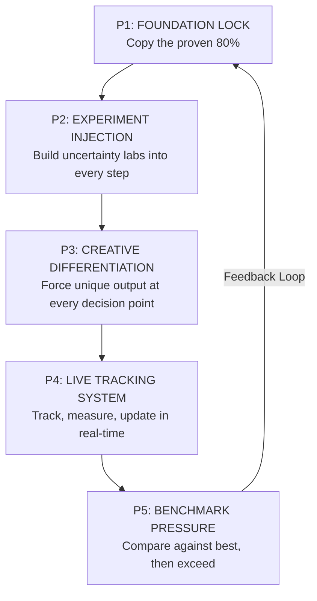

# The X-Framework: Universal Execution Parameter System

> A single, universal checklist that turns **any human** into a benchmark-setter in **any field** — by combining operational speed with creative depth and built-in experimentation for the unknown.

---

## The Core Discovery (Why This Exists)

Every piece of work in the universe — business, research, system, product, art — has **two layers**:

| Layer | What It Is | Source | Value |
|---|---|---|---|
| **Operational Layer (≈80%)** | Proven processes, SOPs, best practices already built by others | Copy + Adapt | Speed & Reliability |
| **Creative-Experience Layer (≈20%)** | Unique thinking, experimentation, differentiation | Generate + Experiment | Benchmark-setting output |

> [!IMPORTANT]
> The fatal mistake is doing 100% of Layer 1 and 0% of Layer 2. You become fast but forgettable. The framework below ensures **both layers fire together** from Day 1.

---

## Part 1: The Shape — 5 Cascading Parameters

These 5 parameters form a **cascade** — each one feeds the next. They are not optional. They are not phases. They run **simultaneously** from the moment work begins until the task stops.



### P1 — FOUNDATION LOCK 🔒
> *"Copy the proven 80% — fast."*

| Checkpoint | Question to Ask | ✅ Tick When |
|---|---|---|
| 1.1 Reference Scan | Who has already built this or something similar? | You have 3-5 references documented |
| 1.2 Structure Copy | What operational structure/SOP can I directly adopt? | You've adopted a proven structure |
| 1.3 Tool Stack Lock | What tools, frameworks, systems already solve the boring parts? | Your tool stack is set, not custom-built |
| 1.4 Execution Template | Do I have a repeatable template/playbook for the operational work? | You can execute the 80% on autopilot |

> [!TIP]
> **Rule**: Spend maximum **20% of your time** on P1. If you're spending more, you're over-engineering the commodity part.

---

### P2 — EXPERIMENT INJECTION 🧪
> *"The things that take 10 years of experience to learn — force them to surface in Week 1."*

This is the **breakthrough parameter**. Most people wait for experience to teach them what can go wrong. You **design experiments to discover the unknowns early**.

| Checkpoint | Question to Ask | ✅ Tick When |
|---|---|---|
| 2.1 Unknown Mapping | What are the 3-5 things I **don't know** that could kill this? | You've listed your unknowns honestly |
| 2.2 Small Bet Design | For each unknown, what's the smallest test I can run to learn? | Each unknown has a mini-experiment |
| 2.3 Failure Budget | How much time/money am I allocating to experiments that might fail? | Budget is set (10-15% of total) |
| 2.4 Speed of Learning | Am I getting results from experiments in days, not months? | Experiment cycles are < 1 week |
| 2.5 Experience Capture | Am I documenting what each experiment taught me? | Learnings are logged, not just results |

> [!CAUTION]
> **Without P2, you are gambling.** You're hoping the unknowns don't hit you. With P2, you are **hunting the unknowns** before they find you.

---

### P3 — CREATIVE DIFFERENTIATION 🎨
> *"The output must be unique, creative, rich — not a copy."*

| Checkpoint | Question to Ask | ✅ Tick When |
|---|---|---|
| 3.1 Uniqueness Test | If someone else followed the same P1 steps, would my output look different from theirs? | Answer is YES — you can explain how |
| 3.2 Breakdown Thinking | Have I broken this problem into pieces no one else has? | You have at least 1 novel decomposition |
| 3.3 Cross-Pollination | Have I pulled an idea from a completely different field/industry? | At least 1 borrowed idea documented |
| 3.4 Creative Constraint | Have I set an intentional constraint that forces innovation? | The constraint is defined and active |
| 3.5 Output Signature | Does this work have my "fingerprint" — something only I would do? | You can point to the signature element |

> [!NOTE]
> **P3 is not about being weird.** It's about applying your unique lens. The operational 80% makes you competitive. P3 makes you **irreplaceable**.

---

### P4 — LIVE TRACKING SYSTEM 📊
> *"If you can't see it, you can't improve it."*

| Checkpoint | Question to Ask | ✅ Tick When |
|---|---|---|
| 4.1 Metric Definition | What are the 3-5 numbers that tell me if this is working? | Metrics are defined and measurable |
| 4.2 Tracking Cadence | How often am I checking these numbers? | Daily or weekly review is scheduled |
| 4.3 Update Protocol | When data shows something isn't working, what's my response time? | Response protocol is defined (< 48 hrs) |
| 4.4 Experiment Metrics | Are P2 experiment results feeding back into P1 and P3? | Feedback loop is active |
| 4.5 Visible Dashboard | Can I see my progress at a glance in under 10 seconds? | Dashboard/tracker exists |

---

### P5 — BENCHMARK PRESSURE 🏆
> *"Don't just finish. Finish at a level that resets the standard."*

| Checkpoint | Question to Ask | ✅ Tick When |
|---|---|---|
| 5.1 Benchmark Identification | Who currently holds the benchmark in this area? | You know the current best and why |
| 5.2 Gap Analysis | Where exactly am I below, at, or above the benchmark? | Gap is mapped with specifics |
| 5.3 Exceed Strategy | What's my specific plan to exceed, not just match? | Plan exists with timeline |
| 5.4 External Validation | Has someone outside my bubble confirmed the quality? | At least 1 external review completed |
| 5.5 New Standard Declaration | Can I articulate what new standard this work sets? | You can state it in one sentence |

---

## Part 2: What You Can Build With This Shape

This framework is **domain-agnostic**. Here's what it unlocks:

| Domain | P1 (Copy Fast) | P2 (Experiment) | P3 (Differentiate) | P5 (Benchmark) |
|---|---|---|---|---|
| **Starting a Business** | Copy proven business models | Test pricing, audience, channels in micro-bets | Your unique positioning & brand voice | Outperform industry conversion rates |
| **Research Paper** | Follow established methodology | Run edge-case experiments others skip | Novel hypothesis or framework | Citation-worthy contribution |
| **Software Product** | Use proven architecture & libraries | Prototype risky features first | Unique UX/feature innovation | Best-in-class performance metrics |
| **Client Agency** | Adopt industry SOPs for delivery | A/B test strategies before scaling | Creative campaigns with your signature | Client results that become case studies |
| **Learning a Skill** | Follow the best courses/teachers | Practice in uncomfortable scenarios | Develop your own technique/style | Compete with 10-year veterans in 2 years |
| **Content Creation** | Study what performs in your niche | Test formats, hooks, angles weekly | Your unique voice and storytelling | Engagement that outperforms category average |

---

## Part 3: The Execution Checklist — Tick-by-Tick

### 🚀 Phase A: START (Before any work begins)

```
□ A1. [P1] I have scanned 3-5 references of who's already done this well
□ A2. [P1] I have a structure/template I'm building on (not from scratch)
□ A3. [P2] I have listed 3-5 unknowns that could derail this
□ A4. [P2] I have designed a small experiment for each unknown
□ A5. [P3] I have identified what will make MY output different
□ A6. [P4] I have defined 3-5 success metrics
□ A7. [P5] I know who the current benchmark-holder is
```

### ⚡ Phase B: EXECUTE (While doing the work)

```
□ B1. [P1] The operational/routine parts are running on autopilot
□ B2. [P2] Experiments are running — I'm not waiting for "more data"
□ B3. [P2] I'm documenting what experiments teach me
□ B4. [P3] At every decision point, I'm asking "Is this the obvious choice or MY choice?"
□ B5. [P3] I've pulled at least one idea from a different field
□ B6. [P4] I'm checking my metrics at my defined cadence
□ B7. [P4] When data says pivot, I pivot within 48 hours
□ B8. [P5] I'm comparing my progress to the benchmark regularly
```

### 🏁 Phase C: FINISH (Before declaring done)

```
□ C1. [P1] All operational deliverables are complete and clean
□ C2. [P2] All experiments have conclusions documented
□ C3. [P2] Unknowns that were discovered are now known
□ C4. [P3] The output has my creative fingerprint — it's not generic
□ C5. [P3] I can explain in 1 sentence what's unique about this
□ C6. [P4] Final metrics are recorded and compared to starting point
□ C7. [P5] I can articulate: "This work sets a new standard because ___"
□ C8. [P5] At least one external person has validated the quality
```

---

## The One Rule That Binds It All

```
┌─────────────────────────────────────────────────────────────────┐
│                                                                 │
│   COPY the system. CREATE the output. EXPERIMENT with the       │
│   unknowns. TRACK everything. EXCEED the benchmark.             │
│                                                                 │
│   — Start ANY work. Follow the ticks. Don't stop until          │
│     every box is checked. That's the parameter.                 │
│                                                                 │
└─────────────────────────────────────────────────────────────────┘
```

> [!IMPORTANT]
> **The sequence matters**: P1 gives you speed → P2 gives you safety from the unknown → P3 makes you irreplaceable → P4 keeps you honest → P5 makes you legendary. Skip any one, and the system leaks.

---

## Quick-Start: Apply This in 5 Minutes

1. **Open a blank page**
2. **Write the name of your work/task/project**
3. **Go to Phase A checklist above — tick A1 through A7**
4. **If any box can't be ticked, that's your first action item**
5. **Start working. Keep Phase B visible. Tick as you go.**
6. **Before you ship, run Phase C. Every unticked box = work remaining.**

*This is not a philosophy. This is a machine. Feed it any work. It produces benchmark-level output.*
